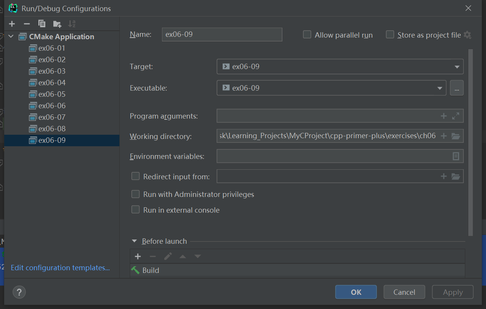

# 习题6.9

&emsp;&emsp;完成编程练习6，但从文件中读取所需的信息。该文件的第一项应为捐款人数，余下的内容应为成对的行。在每一对中，第一行为捐款人姓名，第二行为捐款数额。即该文件类似于下面：
```
4
Same Stone
2000
Freida Flass
100500
Tammy Tubbs
5000
Rich Raptor
55000
```

**解答：**  
代码位置：`exercises/ch06/ex09.cpp`
```c++
#include <iostream>
#include <fstream>

using namespace std;

struct patrons {
    string name;
    double fund;
};

int main() {
    int patrons_count;
    patrons *patrons_array{};
    bool empty_flag = true;

    string file_name;
    ifstream inFile;
    // input files/patrons.txt
    cout << "Enter the name of patrons file:";
    getline(cin, file_name);
    inFile.open(file_name);

    if (!inFile.is_open()) {
        cout << "Could not open the file " << file_name << endl;
        cout << "Program terminating.\n";
        exit(EXIT_FAILURE);
    }

    inFile >> patrons_count;
    inFile.get();
    if (patrons_count <= 0) {
        cout << "The number of patrons is invalid.\n";
        cout << "Program terminating.\n";
        exit(EXIT_FAILURE);
    }

    patrons_array = new patrons[patrons_count];
    int index = 0;
    while (!inFile.eof() && index < patrons_count) {
        getline(inFile, patrons_array[index].name);
        inFile >> patrons_array[index].fund;
        inFile.get();
        index++;
    }

    inFile.close();

    cout << "=====Grand Patrons=====" << endl;
    for (int i = 0; i < patrons_count; i++) {
        if (patrons_array[i].fund >= 10000) {
            cout << patrons_array[i].name << ": " << patrons_array[i].fund << endl;
            empty_flag = false;
        }
    }

    if (empty_flag) {
        cout << "none" << endl;
    }

    empty_flag = true;
    cout << "=====Other Patrons=====" << endl;
    for (int i = 0; i < patrons_count; i++) {
        if (patrons_array[i].fund < 10000) {
            cout << patrons_array[i].name << ": " << patrons_array[i].fund << endl;
            empty_flag = false;
        }
    }

    if (empty_flag) {
        cout << "none" << endl;
    }

    return 0;
}
```

该程序需要配置工作目录，用于读取文件相对路径（`exercises/ch06`），具体配置信息见下图：


**执行结果：**  
```
cpp-primer-plus\cmake-build-debug-mingw\ex06-09.exe
Enter the name of patrons file:files/patrons.txt
=====Grand Patrons=====
Freida Flass: 100500
Rich Raptor: 55000
=====Other Patrons=====
Same Stone: 2000
Tammy Tubbs: 5000

Process finished with exit code 0
```