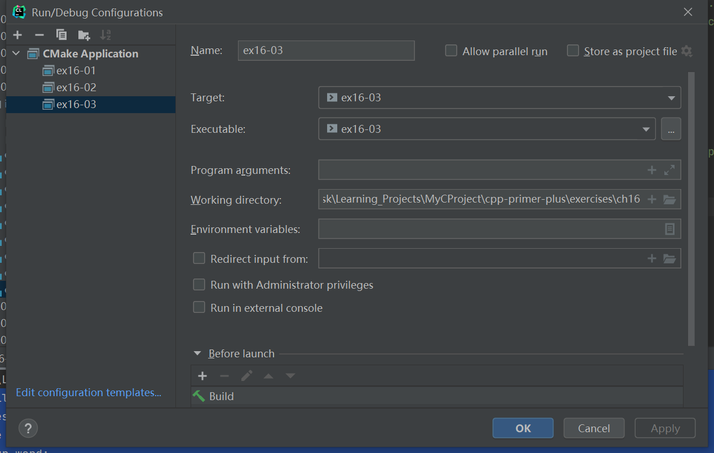

# 习题16.3

&emsp;&emsp;修改程序清单16.3，使之从文件中读取单词。一种方案是，使用`vector<string>`对象而不是`string`数组。这样便可以`push_back()`将数据文件总共的单词复制到`vector<string>`对象中，并使用`size()`来确定单词列表的长度。由于程序应该每次从文件中读取一个单词，因此应使用运算符`>>`而不是`getline()`。文件中包括的单词应该用空格、制表符或换行符分隔。

**解答：**  
代码位置：`exercises/ch16/ex03.cpp`
```c++
#include <iostream>
#include <string>
#include <cstdlib>
#include <ctime>
#include <cctype>
#include <fstream>
#include <vector>

using namespace std;
const int NUM = 26;

int main() {
    ifstream fin;
    fin.open("files/wordlist.txt", ifstream::in);
    if (!fin.is_open()) {
        cerr << "Can't open file. Bye.\n";
        exit(EXIT_FAILURE);
    }

    string word;
    vector<string> wordlist;
    if (fin.good()) {
        while (fin >> word) {
            wordlist.push_back(word);
        }
    }


    srand(std::time(0));
    char play;
    cout << "Will you play a word game? <y/n>";
    cin >> play;
    play = tolower(play);
    while (play == 'y') {
        string target = wordlist[rand() % NUM];
        int length = target.length();
        string attempt(length, '-');
        string badchars;
        int guesses = 6;
        cout << "Guess my secret word. It has " << length
             << " letters, and you guess\n"
             << "one letter at a time. You get " << guesses
             << " wrong guesses.\n";
        cout << "Your word: " << attempt << endl;
        while (guesses > 0 && attempt != target) {
            char letter;
            cout << "Guess a letter:";
            cin >> letter;
            if (badchars.find(letter) != string::npos
                || attempt.find(letter) != string::npos) {
                cout << "You already guessed that. Try again.\n";
                continue;
            }
            int loc = target.find(letter);
            if (loc == string::npos) {
                cout << "Oh, bad guess!\n";
                --guesses;
                badchars += letter; // add to string
            } else {
                cout << "Good guess!\n";
                attempt[loc] = letter;
                // check if letter appears again
                loc = target.find(letter, loc + 1);
                while (loc != string::npos) {
                    attempt[loc] = letter;
                    loc = target.find(letter, loc + 1);
                }
            }
            cout << "Your word: " << attempt << endl;
            if (attempt != target) {
                if (badchars.length() > 0)
                    cout << "Bad choices: " << badchars << endl;
                cout << guesses << " bad guesses left\n";
            }
        }
        if (guesses > 0)
            cout << "That's right!\n";
        else
            cout << "Sorry, the word is " << target << ".\n";

        cout << "Will you play another? <y/n>";
        cin >> play;
        play = tolower(play);
    }

    cout << "Bye\n";

    return 0;
}
```

&emsp;&emsp;该程序需要配置工作目录，用于读取文件相对路径（`exercises/ch16`），具体配置信息见下图：  


**执行结果：**  
```
cpp-primer-plus\cmake-build-debug\ex16-03.exe
Will you play a word game? <y/n>y
Guess my secret word. It has 6 letters, and you guess
one letter at a time. You get 6 wrong guesses.
Your word: ------
Guess a letter:e
Good guess!
Your word: e-----
6 bad guesses left
Guess a letter:a
Oh, bad guess!
Your word: e-----
Bad choices: a
5 bad guesses left
Guess a letter:g
Good guess!
Your word: e---g-
Bad choices: a
5 bad guesses left
Guess a letter:s
Good guess!
Your word: e-s-g-
Bad choices: a
5 bad guesses left
Guess a letter:n
Good guess!
Your word: ens-gn
Bad choices: a
5 bad guesses left
Guess a letter:i
Good guess!
Your word: ensign
That's right!
Will you play another? <y/n>n
Bye

Process finished with exit code 0
```