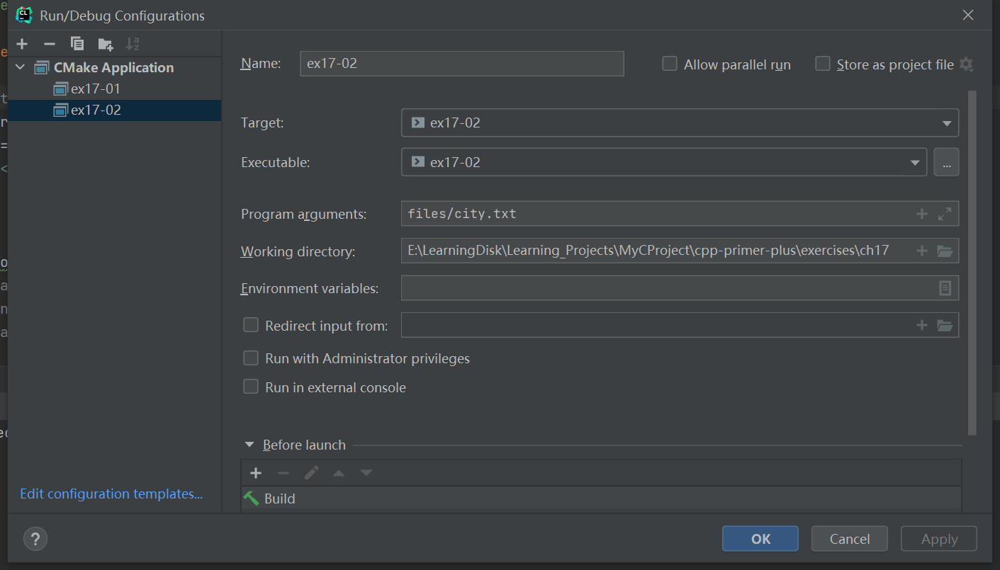

# 习题17.2

&emsp;&emsp;编写一个程序，将键盘输入（直到模拟的文件尾）复制到通过命令行指定的文件中。

**解答：**  
代码位置：`exercises/ch17/ex02.cpp`
```c++
#include <iostream>
#include <fstream>

using namespace std;

// files/city.txt
int main(int argc, char *argv[]) {
    if (argc == 1) {
        cout << "Usage: " << argv[0] << " filename" << endl;
    }

    char ch;
    ofstream fout(argv[1], ios_base::out);
    // input data:
    // San Francisco
    // San Rafael
    // Oakland
    // Berkeley
    // Brooklyn
    // Staten Island
    if (fout.is_open()) {
        cout << "Please input the data:" << endl;
        while (cin.get(ch) && ch != '&') {
            fout << ch;
        }
    } else {
        cout << "Can't create the file " << argv[1] << endl;
        exit(EXIT_FAILURE);
    }
    fout.close();
    return 0;
}
```

该程序需要配置命令行参数和工作目录，用于读取文件相对路径，具体配置信息见下图：


**执行结果：**  
```
cpp-primer-plus\cmake-build-debug\ex17-02.exe files/city.txt
Please input the data:
San Francisco
San Rafael
Oakland
Berkeley
Brooklyn
Staten Island&

Process finished with exit code 0
```

查看文件`file/city.txt`中的内容：
```
San Francisco
San Rafael
Oakland
Berkeley
Brooklyn
Staten Island
```