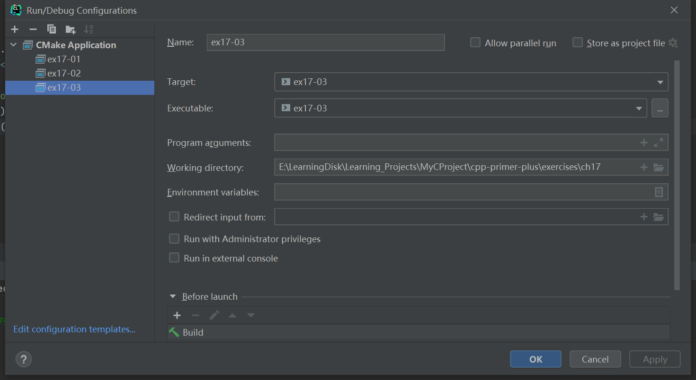

# 习题17.3

&emsp;&emsp;编写一个程序，将一个文件复制到另一个文件中。让程序通过命令行获取文件名。如果文件无法打开，程序将指出这一点。

**解答：**  
代码位置：`exercises/ch17/ex03.cpp`
```c++
#include <iostream>
#include <fstream>

using namespace std;

int main() {
    string src_filename;
    string dest_filename;

    // input files/city.txt
    cout << "Enter name of the src file:";
    getline(cin, src_filename);

    // input files/city_copy.txt
    cout << "Enter name of the dest file:";
    getline(cin, dest_filename);

    ifstream fin(src_filename, ios_base::in);
    ofstream fout(dest_filename, ios_base::out);

    if (!fin.is_open()) {
        cout << "Can't open the file " << src_filename << " !" << endl;
        exit(EXIT_FAILURE);
    }
    if (!fout.is_open()) {
        cout << "Can't open the file " << dest_filename << " !" << endl;
        exit(EXIT_FAILURE);
    }

    char ch;
    while (fin.get(ch))
        fout << ch;

    cout << "Complete file copy!" << endl;
    fin.close();
    fout.close();
    return 0;
}
```

该程序需要配置工作目录，用于读取文件相对路径，具体配置信息见下图：


**执行结果：**  
```
cpp-primer-plus\cmake-build-debug\ex17-03.exe
Enter name of the src file:files/city.txt
Enter name of the dest file:files/city_copy.txt
Complete file copy!

Process finished with exit code 0
```

查看文件`files/city_copy.txt`的内容：
```
San Francisco
San Rafael
Oakland
Berkeley
Brooklyn
Staten Island
```