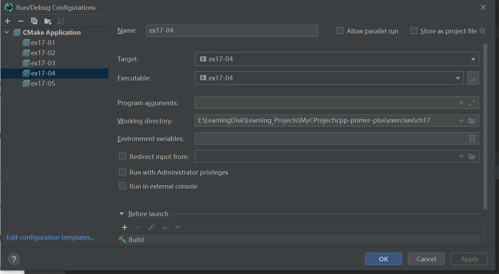

# 习题17.4

&emsp;&emsp;编写一个程序，它打开两个文本文件进行输入，打开一个文本文件进行输出。该程序将两个输入文件中对应的行拼接起来，并用空格分隔，然后将结果写入到输出文件中。如果一个文件比另一个短，则将较长文件中余下的几行直接复制到输出文件中。例如，假设第一个输入文件的内容如下：
```
eggs kites donuts
balloons hammers
stones
```
&emsp;&emsp;而第二个输入文件的内容如下：
```
zero lassitude
finance drama
```
则得到的文件的内容将如下：
```
eggs kites donuts zero lassitude
balloons hammers finance drama
stones
```

**解答：**  
代码位置：`exercises/ch17/ex04.cpp`
```c++
#include <iostream>
#include <fstream>
#include <string>

using namespace std;

int main() {
    string line;

    ifstream fin1("files/file1.txt", ios_base::in);
    ifstream fin2("files/file2.txt", ios_base::in);
    ofstream fout("files/combfile.txt", ios_base::out);

    bool file1_flag = false;
    if (fin1.is_open() && fin2.is_open() && fout.is_open()) {
        while (!fin1.eof() || !fin2.eof()) {
            if (getline(fin1, line) && line.size() > 0) {
                fout << line;
                file1_flag = true;
            }
            if (getline(fin2, line) && line.size() > 0) {
                if (file1_flag) {
                    fout << " ";
                }
                fout << line;
                file1_flag = false;
            }
            fout << endl;
        }

    } else {
        cout << "Can't open the file!" << endl;
        exit(EXIT_FAILURE);
    }

    cout << "File comb complete!" << endl;
    fin1.close();
    fin2.close();
    fout.close();
    return 0;
}
```

该程序需要配置工作目录，用于读取文件相对路径，具体配置信息见下图：


**执行结果：**  
```
cpp-primer-plus\cmake-build-debug\ex17-04.exe
File comb complete!

Process finished with exit code 0
```

查看文件`files/combfile.txt`的内容：
```
eggs kites donuts zero lassitude
balloons hammers finance drama
stones
```