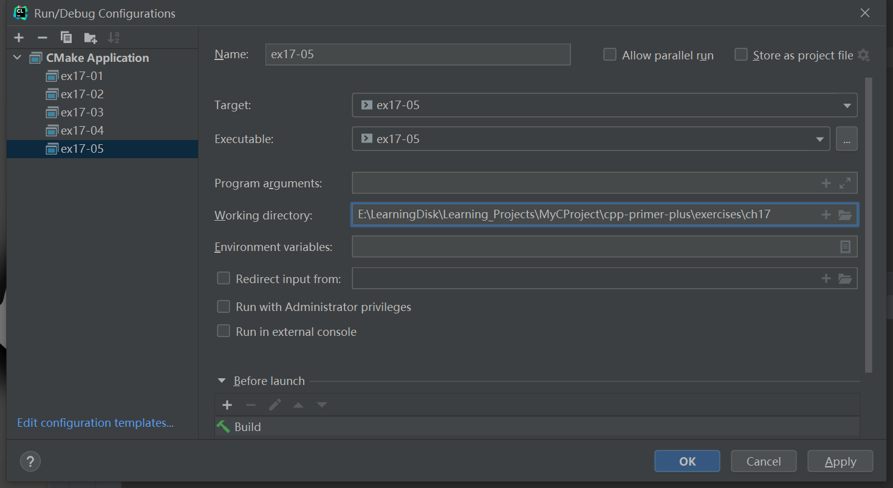

# 习题17.5

&emsp;&emsp;`Mat`和`Pat`想邀请他们的朋友来参加派对，就像第16章总的编程练习8那样，但现在他们希望程序使用文件。他们请您编写一个完成下述任务的程序。
- 从文本文件`mat.dat`中读取`Mat`朋友的姓名清单，其中每行为一个朋友。姓名将被存储在容器，然后按顺序显示出来。
- 从文本文件`pat.dat`中读取`Pat`朋友的姓名清单，其中每行为一个朋友。姓名将被存储在容器中，然后按顺序显示出来。
- 合并两个清单，删除重复的条目，并将结果保存在文件`matnpat.dat`中，其中每行为一个朋友。

**解答：**  
代码位置：`exercises/ch17/ex05.cpp`
```c++
#include <iostream>
#include <fstream>
#include <set>
#include <string>
#include <algorithm>

using namespace std;

void ShowReview(const string &s);

int main() {
    ifstream fin_mat("files/mat.dat", ios_base::in);
    ifstream fin_pat("files/pat.dat", ios_base::in);

    string name;
    set<string> mat_friends, pat_friends, friends;

    if (!fin_mat.is_open() || !fin_pat.is_open()) {
        cout << "Can't open files!" << endl;
        exit(EXIT_FAILURE);
    }

    while (getline(fin_mat, name) && name.size() > 0) {
        mat_friends.insert(name);
    }
    cout << "Mat's friends are: \n";
    for_each(mat_friends.begin(), mat_friends.end(), ShowReview);

    while (getline(fin_pat, name) && name.size() > 0) {
        pat_friends.insert(name);
    }
    cout << "\nPat's friends are: \n";
    for_each(pat_friends.begin(), pat_friends.end(), ShowReview);

    fin_mat.close();
    fin_pat.close();
    friends.insert(mat_friends.begin(), mat_friends.end());
    friends.insert(pat_friends.begin(), pat_friends.end());

    ofstream fout("files/friends.txt", ios_base::out);
    if (!fout.is_open()) {
        cout << "Can't create the file!" << endl;
        exit(EXIT_FAILURE);
    }

    for (const auto &s : friends) {
        fout << s << endl;
    }
    fout.close();

    ifstream fin("files/friends.txt", ios_base::in);
    if (!fin.is_open()) {
        cout << "Can't open the file!" << endl;
        exit(EXIT_FAILURE);
    }

    cout << "\nAll Guest list : \n";
    while (getline(fin, name)) {
        cout << name << endl;
    }
    fin.close();
    return 0;
}

void ShowReview(const string &s) {
    cout << s << endl;
}
```

该程序需要配置工作目录，用于读取文件相对路径，具体配置信息见下图：


**执行结果：**  
```
cpp-primer-plus\cmake-build-debug\ex17-05.exe
Mat's friends are:
Daniel D. Newkirk
David E. Crawford
Graciela C. McCreary
Jennifer E. Greaney
Matthew E. Burrell
Milton M. Grant
Paula J. Cope
Virginia J. Duncan

Pat's friends are:
Alphonso L. French
Barbara S. Simmons
Clarice S. Sartor
Daniel D. Newkirk
Lawrence M. Jones
Mae K. Casillas
Matthew E. Burrell
Monica B. Campbell

All Guest list :
Alphonso L. French
Barbara S. Simmons
Clarice S. Sartor
Daniel D. Newkirk
David E. Crawford
Graciela C. McCreary
Jennifer E. Greaney
Lawrence M. Jones
Mae K. Casillas
Matthew E. Burrell
Milton M. Grant
Monica B. Campbell
Paula J. Cope
Virginia J. Duncan

Process finished with exit code 0
```