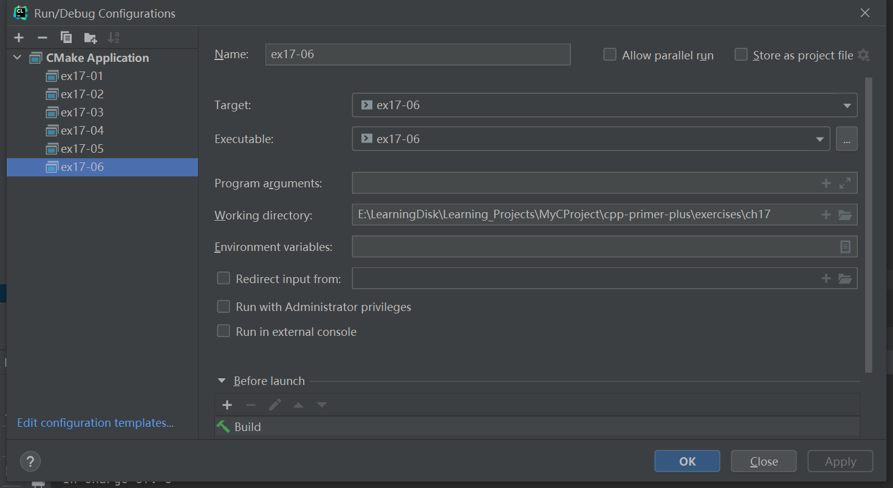

# 习题17.6

&emsp;&emsp;考虑14章的编程练习5中的类定义，如果还没有完成这个练习，请现在就做，然后完成下面的任务。  
&emsp;&emsp;编写一个程序，它使用标准`C++ I/O`、文件`I/O`以及14章的编程练习5中定义的`employee`、`manager`、`fink`和`highfink`类型的书籍。该程序应包含程序清单17.19中的代码行，即允许用户将新数据添加到文件中。该程序首次被运行时，将首先读取并显示文件中的数据，然后让用户添加数据，并显示所有的数据。差别之一是，应通过一个指向`employee`类型的指针数组来处理数据。这样，指针可以指向`employee`对象，也可以指向从`employee`派生出来的其他三种对象中的任何一种。使数组较小有助于检查程序，例如，您可能将数组限定为最多包含10个元素：

```c++
const int Max = 10; // no more than 10 objects
...
employee * pc[MAX];
```
&emsp;&emsp;为通过键盘输入，程序应使用一个菜单，让用户选择要创建的对象类型。菜单将使用一个`switch`，以便使用`new`来创建指定类型的对象，并将它的地址赋给`pc`数组中的一个指针。然后该对象可以使用虚函数`setall()`来提示用户输入相应的数据：
```c++
pc[i]->setall(); //invokes function corresponding to type of object
```
&emsp;&emsp;为将数据保存到文件中，应设计一个虚函数`writeall()`：
```c++
for (i = 0; i < index; i++)
    pc[i]->writeall(fout); // fout ofstream connected to output file
```
&emsp;&emsp;注意：对于这个练习，应使用文本I/O，而不是二进制I/O（遗憾的是，虚对象包含指向虚函数指针表的指针，而`write()`将把这种信息复制到文件中。使用`read()`读取文件的内容，以填充对象时，函数指针值将为乱码，这将扰乱虚函数的行为）。可使用换行符将字段分隔开，这样在输入时将很容易识别各个字段。也可以使用二进制I/O，但不能将对象作为一个整体写入，而应该提供分别对每个类成员应用`write()`和`read()`的类方法。这样，程序将只把所需的数据保存到文件中。  
&emsp;&emsp;比较难处理的部分是使用文件恢复数据。问题在于：程序如何才能知道接下来要恢复的项目是`employee`对象、`manager`对象、`fink`对象还是`highfink`对象？一种方法是，在对象的数据写入文件时，在数据前面加上一个指示对象类型的整数。这样，在文件输入时，程序便可以读取该整数，并使用`switch`语句创建一个适当的对象来接收数据：

```c++
enum classkind{Employee, Manager, Fink, Highfink}; // in class header
...
int classtype;
while((fin >> classtype).get(ch)) { // newline separates int from data
    switch(classtype) {
        case Employee : 
            pc[i] = new employee;
            break;
```
&emsp;&emsp;然后便可以使用指针调用虚函数`getall()`来读取信息：
```c++
pc[i++]->getall();
```

**解答：**  
代码位置：`exercises/ch17/ex06/ex06.cpp`
```c++
#include <iostream>
#include "emp.h"

using namespace std;

const int MAX = 4;
enum classkind {
    Employee, Manager, Fink, Highfink
};

const char *file = "files/emp.txt";

int show_contents();

void show_menu();

int main() {
    // show initial contents
    int count = show_contents();

    // add new data
    ofstream fout(file, ios_base::out | ios_base::app);

    if (!fout.is_open()) {
        cout << "Can't create the file!" << endl;
        exit(EXIT_FAILURE);
    } else {
        char kind;
        while (count < MAX) {
            show_menu();
            while (cin >> kind && (kind != '1' && kind != '2' && kind != '3' && kind != '4' && kind != 'q')) {
                cout << "Enter either 1 or 2 or 3 or 4 or q:";
            }
            while (cin.get() != '\n')
                continue;
            if (kind == 'q') {
                break;
            }

            abstr_emp *p_emp = new employee();
            switch (kind) {
                case '1':
                    p_emp = new employee();
                    p_emp->SetAll();
                    fout << Employee << endl;
                    break;
                case '2':
                    p_emp = new manager();
                    p_emp->SetAll();
                    fout << Manager << endl;
                    break;
                case '3':
                    p_emp = new fink();
                    p_emp->SetAll();
                    fout << Fink << endl;
                    break;
                case '4':
                    p_emp = new highfink();
                    p_emp->SetAll();
                    fout << Highfink << endl;
                    break;
                default:;
            }
            p_emp->writeall(fout);
            count++;
        }
    }
    fout.close();
    cout << endl;

    // show revised file
    show_contents();
    return 0;
}

void show_menu() {
    cout << "Please choice one to add:\n";
    cout << "1) employee     2) manager\n";
    cout << "3) fink         4) highfink\n";
    cout << "q) quit\n";
}

int show_contents() {
    ifstream fin(file);
    int n = 0;

    if (fin.is_open()) {
        cout << "Here are the current contents of the file:\n";

        abstr_emp *pc[MAX];
        int class_type;

        while (fin >> class_type) {
            fin.get();
            switch (class_type) {
                case Employee:
                    pc[n] = new employee;
                    pc[n++]->getall(fin);
                    break;
                case Manager:
                    pc[n] = new manager;
                    pc[n++]->getall(fin);
                    break;
                case Fink:
                    pc[n] = new fink;
                    pc[n++]->getall(fin);
                    break;
                case Highfink:
                    pc[n] = new highfink;
                    pc[n++]->getall(fin);
                    break;
                default:;
            }
        }

        for (int i = 0; i < n; i++) {
            pc[i]->ShowAll();
        }
    }
    fin.close();
    return n;
}
```

该程序需要配置工作目录，用于读取文件相对路径，具体配置信息见下图：


**执行结果：**  
第一次运行程序：  
```
cpp-primer-plus\cmake-build-debug\ex17-06.exe
Please choice one to add:
1) employee     2) manager
3) fink         4) highfink
q) quit
1
Please input the first name:Trip
Please input the last name:Harris
Please input the job title:Thumper
Please choice one to add:
1) employee     2) manager
3) fink         4) highfink
q) quit
2
Please input the first name:Amorphia
Please input the last name:Spindragon
Please input the job title:Nuancer
Please input the number of in charge:5
Please choice one to add:
1) employee     2) manager
3) fink         4) highfink
q) quit
q

Here are the current contents of the file:
Name: Trip Harris
Job Title: Thumper
Name: Amorphia Spindragon
Job Title: Nuancer
In charge of: 5

Process finished with exit code 0
```

第二次运行程序：  
```
cpp-primer-plus\cmake-build-debug\ex17-06.exe
Here are the current contents of the file:
Name: Trip Harris
Job Title: Thumper
Name: Amorphia Spindragon
Job Title: Nuancer
In charge of: 5
Please choice one to add:
1) employee     2) manager
3) fink         4) highfink
q) quit
3
Please input the first name:Matt
Please input the last name:Oggs
Please input the job title:Oiler
Please input the reports to whom:Juno Barr
Please choice one to add:
1) employee     2) manager
3) fink         4) highfink
q) quit
4
Please input the first name:Amorphia
Please input the last name:Spindragon
Please input the job title:Nuancer
Please input the number of in charge:5
Please input the reportsto:Curly Kew

Here are the current contents of the file:
Name: Trip Harris
Job Title: Thumper
Name: Amorphia Spindragon
Job Title: Nuancer
In charge of: 5
Name: Matt Oggs
Job Title: Oiler
REPORT TO: Juno Barr
Name: Amorphia Spindragon
Job Title: Nuancer
In charge of: 5
Reportsto: Curly Kew

Process finished with exit code 0
```